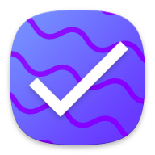

# Tasker

Hey there! Welcome to Tasker, the super user-friendly task management app that's designed to help you stay on top of things. With Tasker, you can easily create, organize, and prioritize your tasks, making it a breeze to reach your goals and meet your deadlines. The app's clean and simple interface helps you focus on your tasks without any unnecessary distractions. Whether you're juggling personal projects or work-related tasks, Tasker is here to boost your productivity and time management skills!

## Android Releases
| Release name | Release Version | Release Links | 
| ------------ | --------------- | ------------- | 
| Tasker Pre-Release | v.1.0.0+1 | [release v.1.0.0+1](https://github.com/the-asherbrook-06/Tasker/releases/download/Android/Tasker.v1.0.0+1.apk) |

## iOS Releases
Coming soon

## macOS Releases
Coming soon

## Windows Releases
Coming soon

## Linux Releases
Coming soon

## Contact us
| Name | Role | Email |
| ---- | ---- | ----- |
| Santhosh Sivakumar | Lead Developer | [2005.santhoshsivakumar@gmail.com](mailto:2005.santhoshsivakumar@gmail.com)